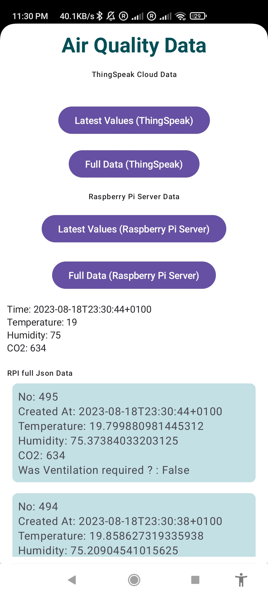
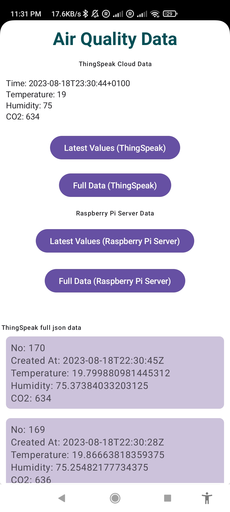

# IndoorAirQualityEE5003

## Intelligent Indoor Air Quality and Ventilation Management in Confined Spaces using IoT

### Problem Statement

- In recent years, energy-efficient homes have become more airtight, leading to decreased ventilation and potential health concerns.
- We don’t know at what time CO2 levels are high
- Everyone cannot operate windows/ventilators often to allow fresh air
- No access to data all the time with and without internet

### Main Objective of Project

- Implement an air quality and temperature monitoring system using Raspberry Pi and an Adafruit SCD40 Sensor (CO2, humidity, and temperature).
- Automate responsive actions such as vent control using a servo motor to optimise the indoor environment.
- Provide timely alerts to notify individuals of any potential air quality issues.
- Automate generation of air quality reports in Raspberry Pi (Provided results like how often it's required to allow fresh air or operate ventilation)

### Added Objectives while development

- To add server functionality to the Raspberry Pi and expose APIs to get the data in different formats (JSON, CSV)
- To develop a reliable Android mobile application that shows recent and historical data from ThingSpeak Cloud and Raspberry Sever to continuously provide users with sensor data information.
- To test the project with an additional DHT11 sensor to make a comparative analysis of the performance

## Information about git repository

The entire project code was implemented using different branches, and after each task was completed, the related branch was merged into the master-integration branch. And at final stage that was merged into main branch, so all the latest code can be found in main branch.

***To retain the old changes, No branches were deleted from starting***

### All Branches in the repository

### [Project Board](https://github.com/users/VishnuSimhaDCU/projects/1/views/1)

#### Whole project was implemented by following below steps:

- Created a task in the project board and defined what the task is, and updated the progress of the task promptly.
- Created a separate branch from the master-integration branch for each valuable feature.
- Worked on that branch, and when completed, all the changes were merged into the master-integration branch

So each branch will have some additional features or changes right from starting. And all the changes can be seen in the main branch together.

**Another View**

## Project Codes

- [Project Master Code](<Project Master Code>) This folder contains the final code of the hardware project [ProjectMasterCode.py](<Project Master Code/ProjectMasterCode.py>), which need to be executed on a Raspberry Pi.
  
- [Reports generation](Reportsgeneration) folder information is detailed in this file, click to navigate -> [ReportsREADME.md](Reportsgeneration/ReportsREADME.md)
  
- [SCD40](SCD40) folder contains all the codes in a [SCD40/code](SCD40/code) folder and some initial test analysis and results.

### [SCD40/code](SCD40/code) folder contains below codes:

Each feature was kept added to the previous code and the the final evolved code is [scd40ThingSpeakLEDServoCSVServerEmail](SCD40/code/scd40ThingSpeakLEDServoCSVServerEmail.py) and [ProjectMasterCode.py](<Project Master Code/ProjectMasterCode.py>) is the final code that needs to be used in Raspberry Pi

- [scd40ThingSpeakLEDServoCSVServerEmail](SCD40/code/scd40ThingSpeakLEDServoCSVServerEmail.py) Latest code
- [scd40ThingSpeakLEDServoCSVServerDHT11](SCD40/code/scd40ThingSpeakLEDServoCSVServerDHT11.py)
- [scd40ThingSpeakLEDServoCSVServer](SCD40/code/scd40ThingSpeakLEDServoCSVServer.py)
- [scd40ThingSpeakLEDServoCSV](SCD40/code/scd40ThingSpeakLEDServoCSV.py)
- [scd40ThingSpeakLEDServo](SCD40/code/scd40ThingSpeakLEDServo.py)
- [scd40ThingSpeakLEDDHT11](SCD40/code/scd40ThingSpeakLEDDHT11.py)
- [scd40ThingSpeakLED](SCD40/code/scd40ThingSpeakLED.py)
- [scd40ThingSpeak](SCD40/code/scd40ThingSpeak.py)
- [adafruitscd40](SCD40/code/adafruitscd40.py) initial code
  
## Android Application Project

[AirQualityMonitor Android Application](AirQualityMonitor) <- committed to a folder

This was the Android application developed; this project needs to be opened with android studio, and then all the gradle files will get automatically synced and then we can build and run the project.

